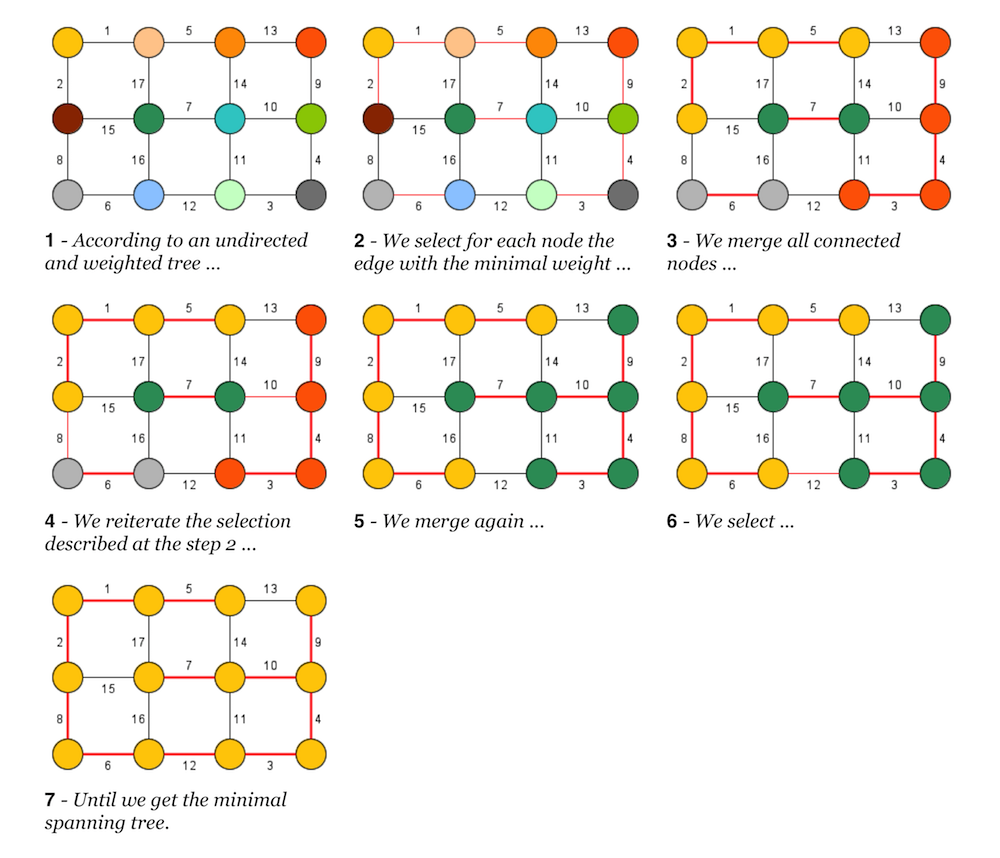
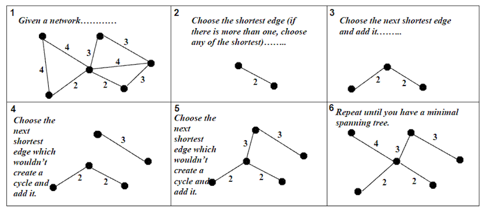
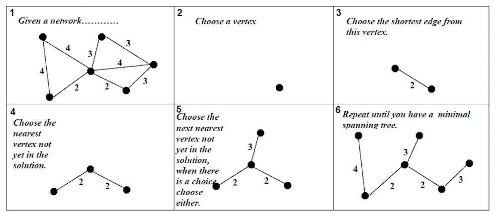

# cl-mst

The Common Lisp library **cl-mst** aims to work with Minimal Spanning Tree in any context with a minimalist syntax.

- - - -

## The Minimal Spanning Tree 

The Minimal Spanning Tree (noted MST) is built from a matrix of distances as a list of weighted edge according to the syntax (node1 node2 weight). Note this concerns only undirected tree. 
The result as MST is a tree without cycle which the nodes are connected according to the minimal distance between 2 nodes.
It exists at least 3 well-know algorithms as:

### `boruvka`
	
Established by Otakar Borůvka in 1926 (also called Sollin's algorithm). The credit of Boruvka's algorithm goes to Otakar Borůvka, Choquet, Florek, Łukasiewicz, Perkal, Steinhaus and Zubrzycki and Georges Sollin.

### `kruskal` 
	
Established by Joseph Kruskal in 1956.

### `prim` 
	
The algorithm was developed in 1930 by Czech mathematician Vojtěch Jarník and later rediscovered and republished by computer scientists Robert Clay Prim in 1957 and Edsger Wybe Dijkstra in 1959. Therefore, it is also sometimes called the Jarník's algorithm, Prim–Jarník algorithm, Prim–Dijkstra algorithm or the DJP algorithm.

- - - -

## measuring tree 

(re-called rhizome because of its shape).

`rhizome-length`
`rhizome-degree`
`rhizome-nodes`
`rhizome-leaves`
`rhizome-path`

- - - -

## Credit

Boruvka ---> https://github.com/gitsridhar/boruvkamst (written in C++ language and require G++ command line) 

Kruskal ---> https://www.cc.gatech.edu/~isbell/classes/2003/cs4600_fall/projects/project3/utils.lisp

Prim and measuring tools ---> http://fredvoisin.com/spip.php?article113 (fv-morphologie)
